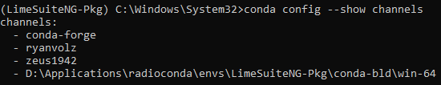

.. _radioconda-setup-ref:

======================
Radioconda environment
======================

Initial set up
---------------

Radioconda installation files can be found in radioconda github `release page`_.

For Windows, install radioconda terminal using ``radioconda-<release-date>-Windows-x86_64.exe`` installer. For Linux, download ``radioconda-<release-date>-Linux-x86_64.sh``, open terminal and install the radioconda environment:

.. code-block:: bash

   cd Downloads
   bash radioconda-<release-date>-Linux-x86_64.sh

To access radioconda environment on Windows, search for **radioconda terminal** and open it with administrator privileges. On Linux radioconda base environment loads automatically once the terminal is opened.

.. tip::

   Linux only. If you want to exit radioconda base environment in terminal, enter ``conda deactivate`` command.

Create new radioconda environment with a custom name and activate it using the following commands:

.. code-block:: bash
   
   conda create -n <custom environment name>
   conda activate <custom environment name>

Install the following packages that contain necessary build tools for the current environment.

.. code-block:: bash

   conda install conda-build conda-forge-pinning

Custom radioconda environment set up is complete.

.. tip::

   Make sure that your LimeSDR device is compatible with the new generation library and install appropriate SDR device drivers. See :ref:`dev-supp-list-ref` and :ref:`driver-supp-list-ref`.

.. _conda-local-channel-setup:

Local channel set up
---------------------

.. note::

   This step is only recommend for project developers and package maintainers.

Setting up local conda channel is usefull for testing locally built conda packages. Conda tool uses channels to pull requested packages when using ``conda install`` tool. If the local channel is not added to the list, conda will most likely fail to install the built package. To set up a local channel, where all the ``conda-build`` tool localy built packages are stored, the following command must be executed:

.. code-block:: bash

   conda config --append channels <radioconda install root>\envs\<your custom env name>\conda-bld\

To double check if the channel was added use the following command:

.. code-block:: bash

   conda config --show channels

Conda should print a similar channel list as shown in **Figure 1**.

   **Figure 1.** Conda channel list

If you are not sure where the root installation of your radioconda is, you can execute the following command to find out your root install path:

.. code-block:: bash

   conda config --show root_prefix

To get the full path to local channel add ``\envs\<your custom env name>\conda-bld\`` to the received ``root_prefix`` value. Once the channel is added to the list, you can install locally built conda packages using the following command:

.. code-block:: bash

   conda install built_package_name

When installing package, you can also specify package version ``built_pacakge_name=1.0.0`` or version and build string ``built_package_name=1.0.0=hb7fb3a4_0`` to install a specific package if more than one variant of the package exists in the local channel. When performing package install, built package build string specification can also help prevent installing already existing packages from the public conda-forge channel. By default ``conda install`` tool searches for packages through different channels that are listed in the channels list starting from the top (refer to **Figure 1**). If abstracted package name is supplied, it is possible that conda will install a package from public channel (if it exists in the public channel) instead of local. By specifying the exact version and build string it is possible to bypass the install from the public channel. A more permanent solution for avoiding incorrect test package installs, is to move the local channel to the top of the channel list. If you already added the channel, then remove it with the following command:

.. code-block:: bash
   
   conda config --remove channels <radioconda install root>\envs\<your custom env name>\conda-bld\

And add it to the top of the list:

.. code-block:: bash

   conda config --add channels <radioconda install root>\envs\<your custom env name>\conda-bld\

Now modify ``channel_priority`` to ``flexible``:

.. code-block:: bash

   conda config --set channel_priority flexible

This will allow conda to resolve any other dependencies that are not present in your local channel when building packages from recipes. 

.. warning::

   Once the development and testing phase of the conda packages is over, it is highly recommended to revert the ``channel_priority`` back to ``strict`` and move the local channel to the bottom of the list (use commands ``conda config --remove channels ...`` and ``conda config --append channels ...``) or completely remove it from the list (use only ``conda config --remove channels ...``) to avoid package installation problems in the future.

.. _`release page`: https://github.com/ryanvolz/radioconda/releases