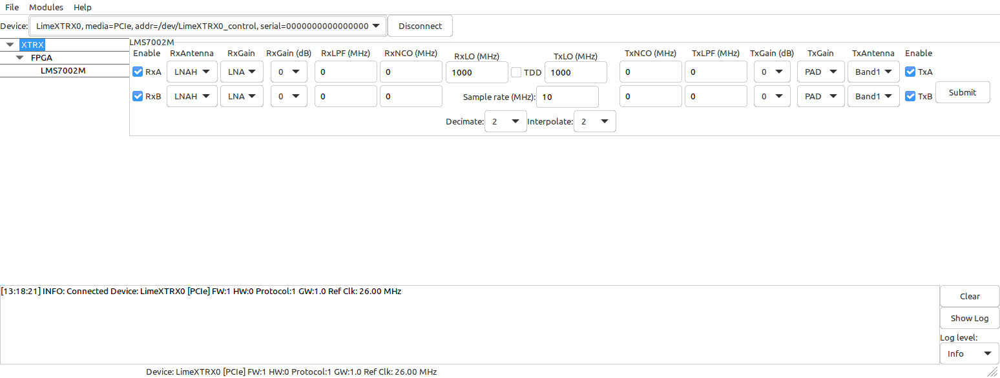
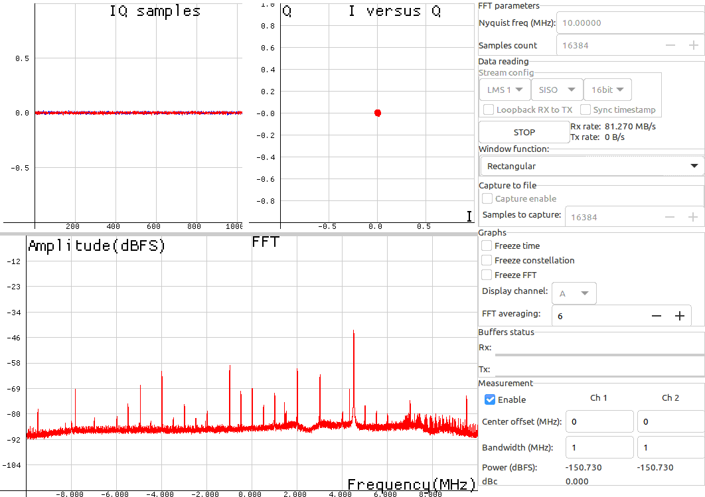
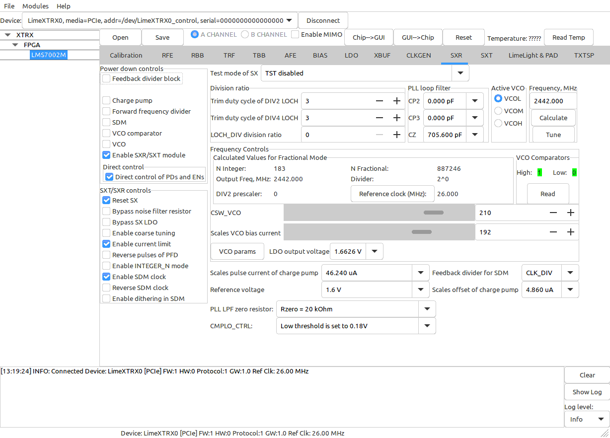

Graphical user interface
========================

``limeGUI`` provides graphical user interface for interacting with the device configuration and data streaming.

When connected to the device, basic configuration options are presented, entering desired parameters and clicking "Submit" will set up device into working state.

When device is in configured state, GUI FFT module can be used to inspect the receiver streaming data in real time.

For advanced configuration all parameters can be controlled directly by selecting the desired device's module.

