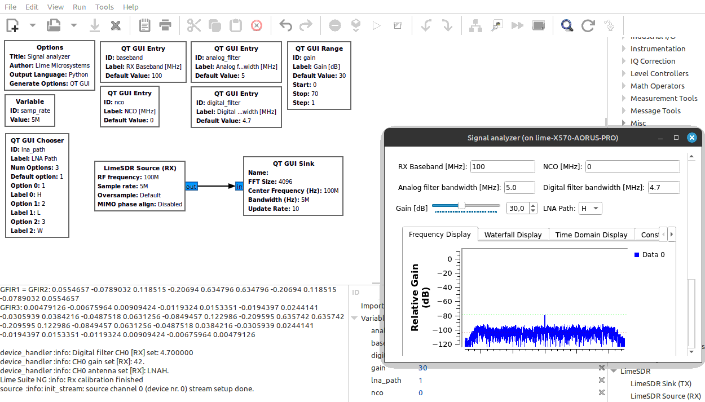

GNURadio
========

https://www.gnuradio.org/

LimeSDR devices can be used with GNU Radio, and also using it's GNU Radio companion GUI blocks.

Checkout the included examples: https://github.com/myriadrf/LimeSuiteNG/blob/develop/plugins/gr-limesdr/examples

