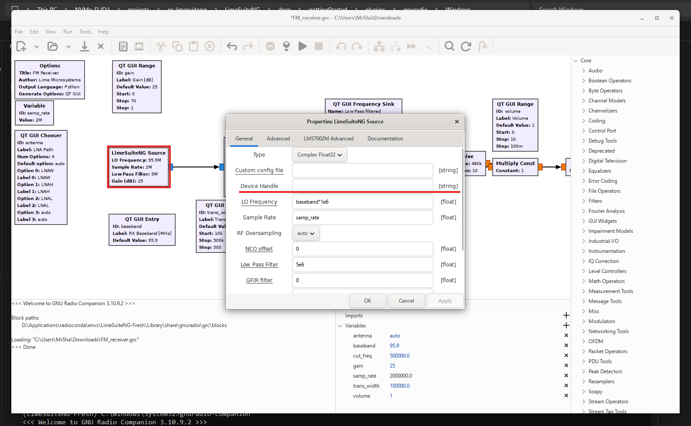

Build from source
=================

Prerequisites
-------------

Required components to compile gnuradio-limesuiteng plugin:

#. Visual Studio Build Tools 2022 17.14 components:

   #. MSVC v143 - VS 2022
   #. Windows 11 SDK

#. Conda packages:

   #. conda-build
   #. conda-forge-pinning
   #. gnuradio=3.10.9.2
   #. gnuradio-build-deps=3.10.9.2
   #. boost=1.82
   #. vs2022_win-64
   #. LimeSuiteNG (Manually built)

.. warning::
   External Python and numpy installations that are not related to any conda environment can interfere with build process. It is advised to remove these components or temporarily disable environment variables that point to their locations in PC file system.

.. warning::
   It is advised to use a manually built and installed LimeSuiteNG library in conda environment to avoid build process problems.

.. note::
   MSVC version must be equal or higher than compiler version that was used to build gnuradio. To check compiler compatibility use ``gnuradio-config-print --cxx`` inside activated conda environment with installed gnuradio.

.. note::
   Visual Studio Build Tools 2019 can also be used to build the plugin, but the MSVC compiler version must be higher or equal to version 19.29.

Compilation
-----------

Activate your conda enivronment:

.. code-block:: bash

   conda activate -n <environment name>

.. hint::
   Check out radioconda and conda environment set up process. See :ref:`radioconda-setup-ref`.
.. Add reference to radioconda and conda setup

Install conda packages:

.. code-block:: bash

   conda install conda-build conda-forge-pinning gnuradio=3.10.9.2 gnuradio-build-deps=3.10.9.2 boost=1.82 vs2022_win-64

Downgrade the following packages:

.. code-block:: bash

   conda install cmake=3.26.4 python=3.12 pybind11=2.11.1

Restart radioconda prompt and activate your conda environment. This will setup appropriate build environment variables. Clone repository:

.. code-block:: bash

   git clone <repository url>

Enter plugin directory:

.. code-block:: bash

   cd <repository-location>\plugin\gr-limesuiteng

Create and enter build directory:

.. code-block:: bash

   mkdir build && cd build

Run cmake to configure build files:

.. code-block:: bash

   cmake -G Ninja -DCMAKE_BUILD_TYPE=Release -DCMAKE_INSTALL_PREFIX="%CONDA_PREFIX%\Library" -DCMAKE_PREFIX_PATH="%CONDA_PREFIX%\Library" -DGR_PYTHON_DIR="%CONDA_PREFIX%\Lib\site-packages" ..

Build plugin:

.. code-block:: bash

   cmake --build .

Install plugin into conda environment:

.. code-block:: bash

   cmake --install .

.. tip::
   To uninstall plugin from conda environment use: ``cmake -P cmake_uninstall.cmake`` command inside the build directory.

Testing plugin
--------------

Plug in your limeSDR device into USB port. Execute the following command in an active conda environment to retrieve SDR device serial number:

.. code-block:: bash

   (LimeSuiteNG) D:\LimeSuiteNG\plugins\gr-limesuiteng>limedevice
   Found 1 device(s) :
   0: LimeSDR Mini, addr=0403:601f, serial=00000000000000

Launch gnuradio in conda environment by executing the following command:

.. code-block:: bash

   (LimeSuiteNG) D:\LimeSuiteNG\plugins\gr-limesuiteng>gnuradio-companion

Open ``FM_receiver.grc`` example from repository ``plugin\gr-limesuiteng\examples`` directory. Enter SDR serial number as shown in figure below and run the example.

If the example runs successfully, adjust RX baseband parameter to frequency of a local radio station and adjust volume and gain parameters to normalize sound quality and volume.

.. hint::
   Make sure that the device is supported by Lime Suite NG library. See :ref:`dev-supp-list-ref`.
.. Add reference to supported device list