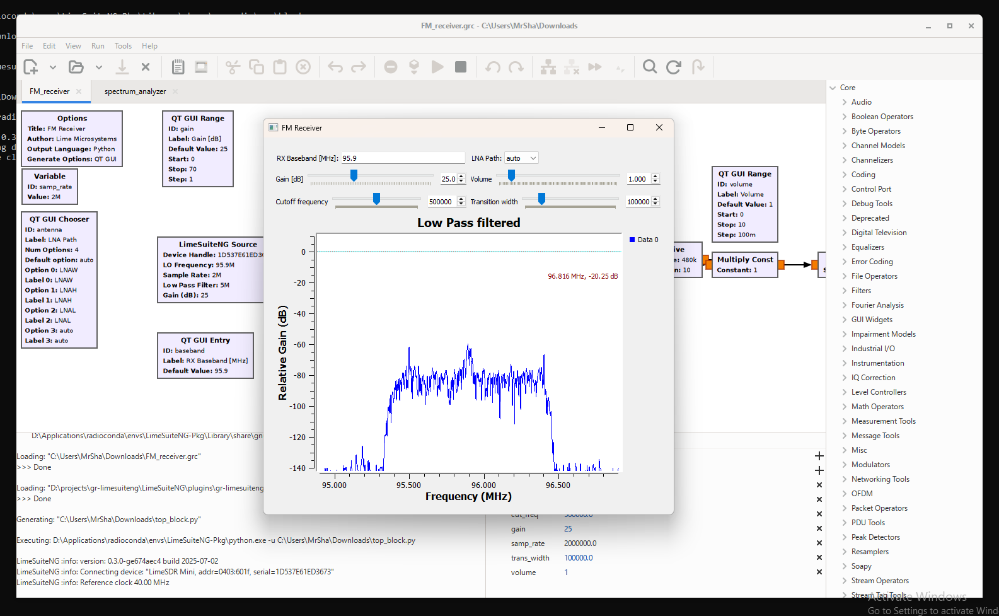

.. _gnuradio-limesuiteng-example-ref:

Example Flowgraph
#################

Ensure that your LimeSDR device is connected. If multiple devices are connected, execute the following command in an active conda environment (or in a Linux terminal) to retrieve the required SDR device serial number:

.. code-block:: bash

   (LimeSuiteNG) D:\LimeSuiteNG\plugins\gr-limesuiteng>limedevice
   Found 1 device(s) :
	0: LimeSDR Mini, media=USB 3.0, addr=0403:601f, serial=1D9EFA3E84B944
	1: LimeSDR-USB, media=USB 3.0, addr=1d50:6108, serial=00090706024F2403

Launch GNU Radio in conda environment (or in Linux terminal) by executing the following command:

.. code-block:: bash

   (LimeSuiteNG) D:\LimeSuiteNG\plugins\gr-limesuiteng>gnuradio-companion FM_receiver.grc

.. note::
   
   If the ``FM_receiver.grc`` does not open when launching GNU Radio, open example from one of the following directories: ``<repo root>\plugin\gr-limesuiteng\examples``, ``<radioconda install dir>\envs\<your env>\Library\share\gnuradio\examples\limesuiteng`` (Windows) or ``/usr/local/share/gnuradio/examples/limesuiteng`` (Linux).

If a single LimeSDR device is plugged in, run the example by pressing the play button. The software will automatically detect the LimeSDR device and use it to run the example. If multiple LimeSDR devices are present, you must enter the serial number of the appropriate LimeSDR device as shown in the figure below.

.. image:: settingUpSdr.png

If the example runs successfully, a pop-up window will open as shown below. Adjust the RX baseband parameter to the frequency of a local radio station and adjust the volume and gain parameters inside the pop-up window to normalise the sound quality.

If the audio stream from selected radio station is clear, then the plugin is working correctly. Explore more examples in the ``<repo root>\plugin\gr-limesuiteng\examples`` directory.

.. hint::
   Make sure that the device is supported by Lime Suite NG library. See :ref:`dev-supp-list-ref`.

.. _GNU Radio: https://www.gnuradio.org/